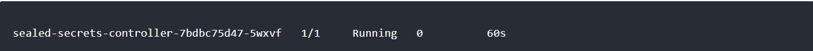

# install-kubeseal
Kubeseal for Kubernetes, in this ttorial I assume your Kubernetes have been installed

## Installing the kubeseal Client
For Linux x86_64 systems, the client-tool may be installed into /usr/local/bin with the following command:
- Download binary kubeseal

you can check or choose version kubeseal on the link below:</br>
https://github.com/bitnami-labs/sealed-secrets/releases/
```bash
wget https://github.com/bitnami-labs/sealed-secrets/releases/download/v0.18.0/kubeseal-0.18.0-linux-amd64.tar.gz
```
- extract file binary
```bash
tar xfz kubeseal-0.18.0-linux-amd64.tar.gz
```
- install binary on bin directory
```bash
sudo install -m 755 kubeseal /usr/local/bin/kubeseal
```


## Installing the Custom Controller and CRD for SealedSecret
Install the SealedSecret CRD, controller on your K8S cluster as follows: 
- Download manifest controller sealed
```bash
wget https://github.com/bitnami-labs/sealed-secrets/releases/download/v0.18.0/controller.yaml
```
- apply your manifest
```bash
kubectl apply -f controller.yaml
```
- Check the status of the controller pod
```bash
kubectl get pods -n kube-system | grep sealed-secrets-controller
```


now kubeseal on your K8S cluster can be used 

## how to use kubeseal on K8S

- create file secret.yaml
```bash
nano secret.yaml
```
- now run command bellow to sealed your secret
```bash
cat secret.yaml | kubeseal --controller-namespace kube-system --controller-name sealed-secrets-controller --namespace=your-namespace --format yaml > sealed-secret.yaml
```
- check your sealed-secret.yaml
```bash
cat sealed-secret.yaml
```
now your secret is sealed !!! 
## 🔗 About me
[](https://www.linkedin.com/in/falyan-zuril-587585247/)
